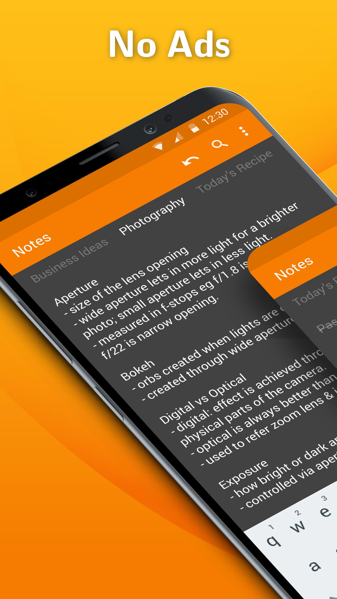
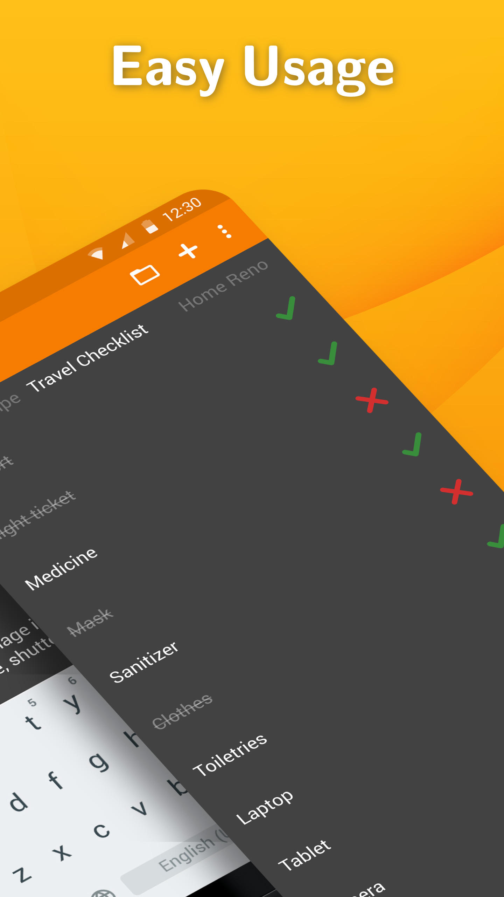
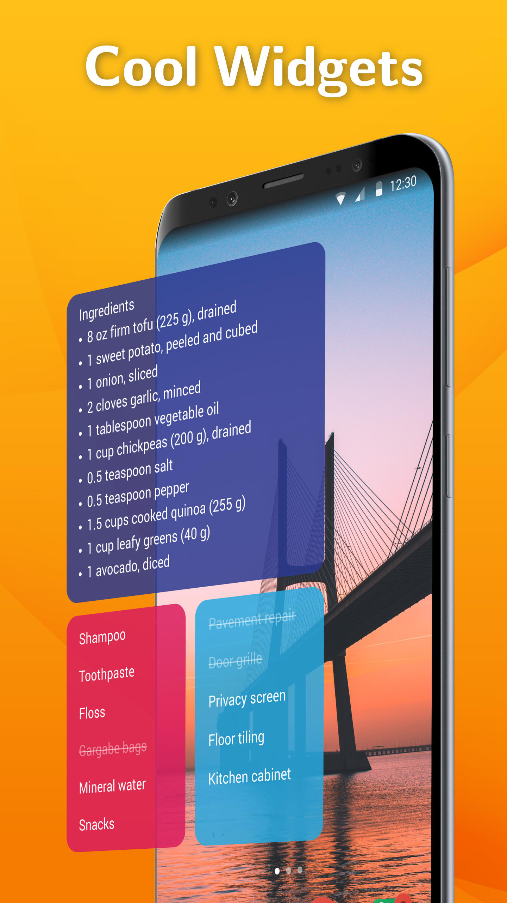

# Simple Notes

A simple textfield for adding quick notes.

Need to take a quick note of something to buy, an address, or a startup idea? Then this is the app you've been looking for! No complicated setup steps needed, just type in what you came for. Comes with autosave, so you will not discard your changes by mistake. Supports creating multiple independent notes.

You can access the note in no time by using the customizable and resizable widget, which opens the app on click.

Contains no ads or unnecessary permissions. It is fully opensource, provides customizable colors.

This app is just one piece of a bigger series of apps. You can find the rest of them at https://www.simplemobiletools.com

