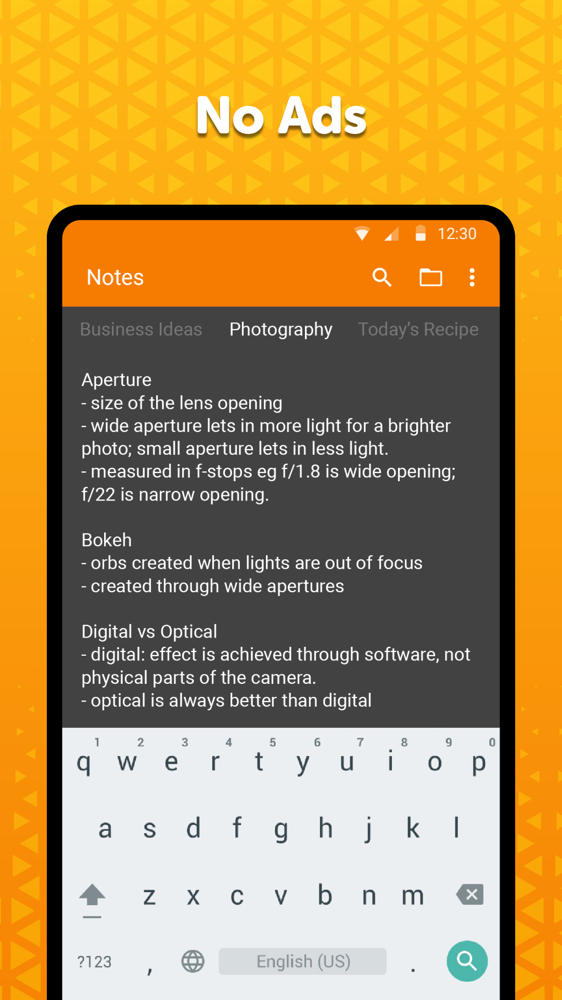
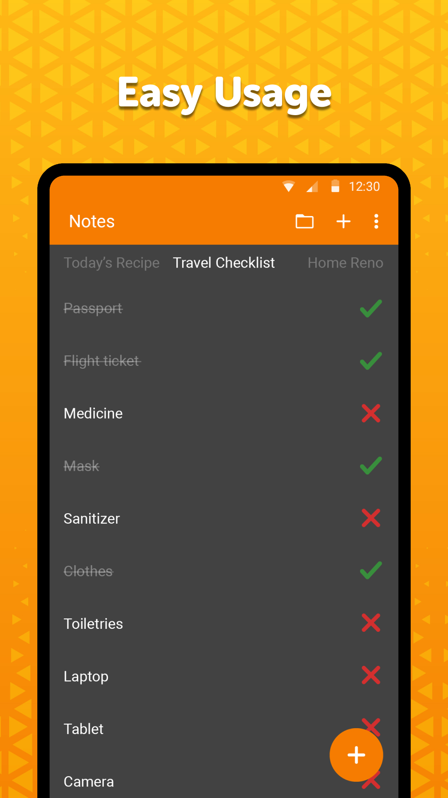
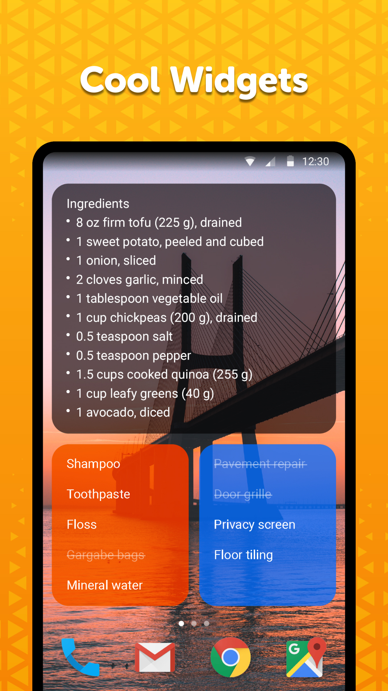

# Simple Notes

★ Need to take a quick note of something to buy, an address, or a startup idea? Then look no further as this is the simple organizer tool you\'ve been looking for : Simple Notes: To-do list organizer and planner! No complicated setup steps needed, just tap the screen and type in what you came for and create notes, quick lists, checklist or backup for any idea. With your simple personal notebook you can remember anything fast! Shopping for groceries, memorizing your thoughts and easier setting up reminders taking notes has never been easier ★

Simple notes planner is quick, simple to use organizer and remarkable planner and it will serve as an invaluable tool and companion, helping you to remember necessary piece of information!

Our reminder tool allows you to keep track of your duties,create daily checklist for items or ideas with unprecedented simplicity, notability and unrivaled time-saving value. Manage your schedule in a quick and simple manner.

This notebook reminder tool comes with autosave so you will not discard your changes by mistake. It also supports creating multiple independent plain text notes and lists very fast.

You can easily access the note and organize your to-do list in no time by using the customizable and resizable widget, which opens the app on tap.

It is user friendly and contains absolutely no ads or unnecessary permissions - no strings attached. It is fully opensource, provides customizable colors which can be adjusted with quick and fast tweaking.

Simple Notes: To-do list organizer and planner is the best item organizer and list planner you can use with no ads. If you need a high quality organizer for a quick and goodnotes, a reliable and user friendly reminder that is truly simple to use, download our app right now :) Have your own personal notebook in your pocket every day and have a backup planner so you will not have to worry about forgetting an important meeting or your shopping list :).

It comes with material design and dark theme by default, provides great user experience for easy usage. The lack of internet access gives you more privacy, security and stability than other apps.

Contains no ads or unnecessary permissions. It is fully opensource, provides customizable colors.

Check out the full suite of Simple Tools here:  
https://www.simplemobiletools.com

Standalone website of Simple Notes Pro:  
https://www.simplemobiletools.com/notes

Facebook:  
https://www.facebook.com/simplemobiletools

Reddit:  
https://www.reddit.com/r/SimpleMobileTools

